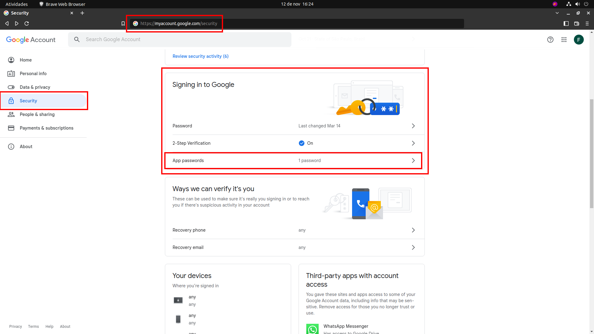
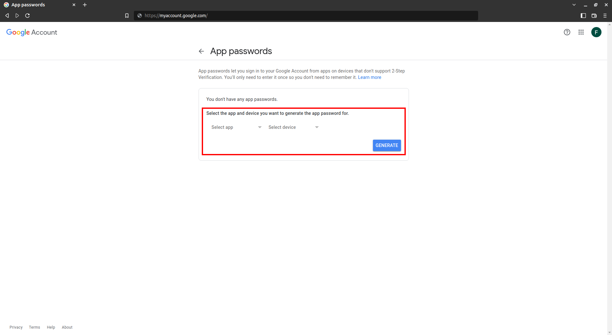
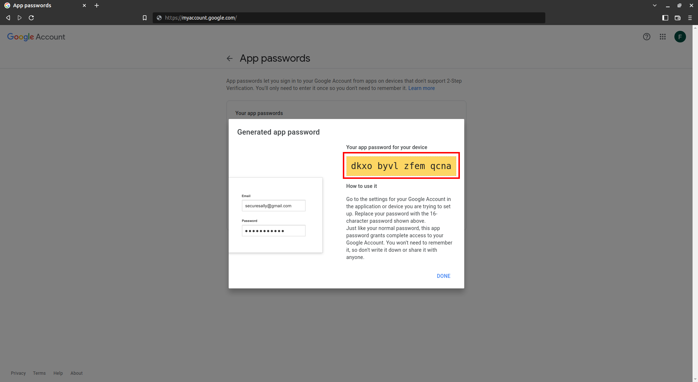

## How generate Gmail password

Access [Gmail security](https://myaccount.google.com/security) and access [App password](https://myaccount.google.com/apppasswords)



### Generate a password

Select the app and device you want to generate the app password for.
```
Select app -> Mail
Select device -> Other (Custom name)
```



Copy a generated password



[<- Back](../README.md)